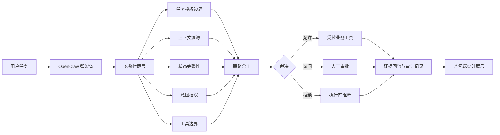
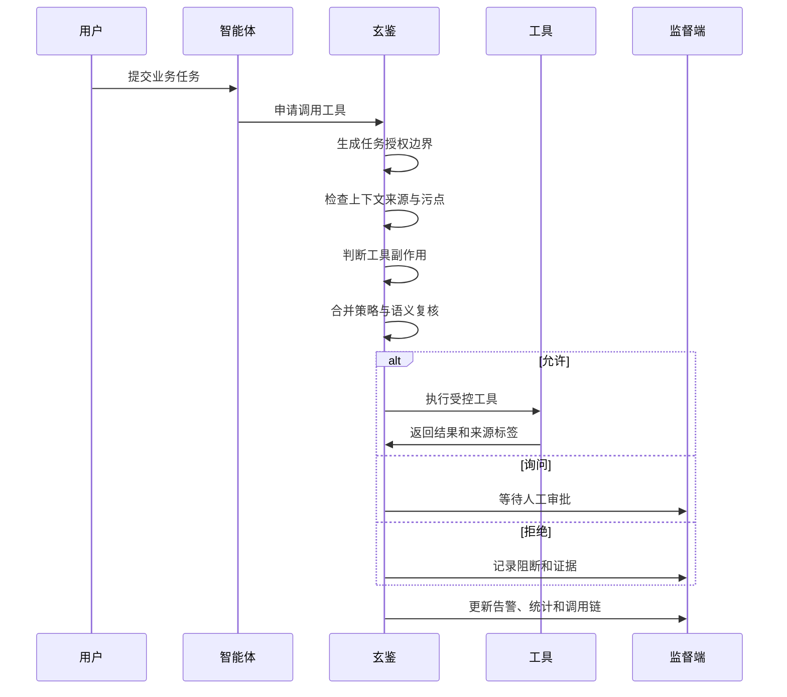

# 填写说明

1. 所有参赛项目必须为一个基本完整的设计。作品报告书旨在能够清晰准确地阐述参赛项目或方案。
2. 作品报告采用 A4 纸撰写。除标题外，所有内容建议为宋体、小四号字、1.5 倍行距。本文为可编辑文稿版本，后续排版到文档时按该要求设置正文样式。
3. 作品报告正文已删除模板中的说明性占位文字，保留本页填写说明。
4. 作品报告结构在模板基础上做了少量微调，增加了攻击场景、系统架构、测试数据和创新性说明。
5. 为保证网评公平、公正，本文不包含学校、院系、指导教师等身份信息。

# 玄鉴：面向智能体工具调用链的实时行为监督与风险拦截系统

## 目  录

摘要  
第一章 作品概述  
第二章 作品设计与实现  
第三章 作品测试与分析  
第四章 创新性说明  
第五章 总结  
参考文献  

## 摘要

大语言模型（Large Language Model，LLM）正在从问答系统进入办公、编程、检索、自动化运维和智能体应用。模型一旦获得读取文件、发送邮件、调用接口、执行命令和写入长期记忆的能力，安全边界便不再只存在于“回答是否合规”，而是延伸到“工具是否被正确使用”。公开研究已经证明，提示注入、工具返回污染、模型上下文协议（Model Context Protocol，MCP）工具投毒和长期记忆污染可以把用户看似正常的任务引向数据外泄、越权执行和持久化控制[1-6]。

玄鉴面向这一类新型风险，设计并实现了一套可嵌入开源智能体应用（OpenClaw）的运行时行为监督系统。系统在智能体执行外部工具前，对网页、文件、邮件、接口、命令、长期记忆和第三方技能进行实时审计，结合任务授权、上下文来源、污点传播、属性访问控制、系统预执行检查和大模型语义裁判（LLM-Judge）给出允许、询问或拒绝的裁决。它不是简单屏蔽关键词，而是围绕“谁授权、数据从哪里来、要流向哪里、落地后有什么副作用”形成可解释的证据链。

作品完成了 OpenClaw 插件、模拟业务工具、监控大屏、对抗样本库、攻击脚本和公开基准测试适配。最新评测通过真实插件接口完成 840 条公开基准样例，其中攻击或期望保护样例 711 条，正常或期望放行样例 129 条，高风险漏放 0 条，误拦 0 条[11-13]。系统能够覆盖外部内容注入、工具调用劫持、MCP 工具投毒、长期记忆污染、命令执行风险和敏感文件外泄等场景，并以可视化方式展示阻断记录、污点流向和策略命中情况。

## 第一章 作品概述

### 1.1 背景分析

传统安全网关主要保护网络边界、身份认证和应用接口。智能体应用带来了新的执行路径：用户给出自然语言任务，模型拆解步骤，工具层完成真实动作。这个过程把“文本”变成了“行动”。当外部网页、邮件、文档和工具返回也进入模型上下文时，攻击者无需直接登录系统，只要把恶意指令藏在低信任内容中，就可能诱导智能体读取本机配置、外发摘要、写入启动项或污染长期记忆。

开放式应用安全项目（Open Worldwide Application Security Project，OWASP）在 2025 年大语言模型应用十大风险中，将提示注入、敏感信息泄露、供应链风险、过度代理能力和不安全输出处理列为重点问题[1]。这些风险在智能体系统中会相互叠加。提示注入负责改变模型意图，工具权限负责把错误意图落地，长期记忆负责把一次攻击延续到后续会话，第三方工具负责扩大供应链攻击面。

学术研究也在向“工具型智能体”聚焦。智能体道场基准（AgentDojo）证明，攻击者可以把间接提示注入藏在邮件、网页或工具返回中，诱使模型在正常用户任务之外执行攻击任务[2]。注入智能体基准（InjecAgent）将攻击样本扩展到工具集成智能体，强调工具响应污染对真实动作链的影响[3]。记忆嫁接攻击（MemoryGraft）关注长期记忆投毒，指出攻击者可以通过经验写入影响未来任务决策[4]。MCP 安全基准（MCPSecBench）和智能体防御基准（AgentDefense-Bench）进一步把安全问题推进到 MCP 工具生态，覆盖工具投毒、工具影子攻击、恶意默认参数、响应操纵和沙箱逃逸等场景[5-6]。工具模拟基准（ToolEmu）、有害智能体基准（AgentHarm）和命令行控制基准（BashArena）说明，带工具模型的风险还包括高影响业务操作、恶意多工具任务和系统命令执行[7-9]。

这些研究共同说明，智能体安全不能只依靠模型提示词约束。提示词可以提示模型“不要泄露秘密”，却很难保证被污染上下文影响后的每一次工具调用都处于用户授权范围内。更稳妥的路线是在模型和工具之间建立运行时监督层，把工具调用视为需要审计的安全事件，在执行前进行来源、权限、数据流和副作用检查。

### 1.2 作品定位

玄鉴的定位是智能体工具调用链上的行为监督与风险拦截系统。它既可以嵌入 OpenClaw 插件链路，也可以作为旁路审计系统观察智能体与外部工具的交互。系统面向比赛题目中的红队攻击面，重点研究外部内容注入、模型越狱与提示抽取、训练或上下文数据泄露、工具调用劫持、记忆中毒、环境感知污染和命令执行风险。

作品没有把智能体视作单一模型。真实系统由用户任务、模型规划、外部上下文、工具参数、历史记录、记忆和运行环境共同组成。玄鉴把这些对象统一转化为审计证据，再由策略引擎给出裁决。这样可以做到“正常业务尽量不打断，高风险动作执行前阻断，需要人工判断的动作进入询问态”。

### 1.3 相关工作

提示注入研究最早关注攻击者通过自然语言覆盖模型原有指令。随着模型接入工具，间接提示注入成为更现实的威胁。AgentDojo 和 InjecAgent 的样例表明，恶意内容经常隐藏在网页、邮件、文档和工具返回中，用户并不会主动要求读取密钥或外发数据，危险动作由模型在执行中被诱导生成[2-3]。

记忆投毒研究把攻击时间拉长。MemoryGraft 指出，攻击者不一定要一次完成外泄，也可以先把错误偏好写成“经验”，后续再借正常任务触发外部路由或审批绕过[4]。这类攻击要求防御系统在写入长期记忆时记录来源和完整性，在读取记忆时重新判断其可信度。

工具生态安全研究关注智能体“能调用什么”。MCPSecBench 和 AgentDefense-Bench 将 MCP 工具描述、参数和返回值纳入威胁模型，显示工具本身可以通过描述伪装、默认参数、延迟触发和响应操纵影响智能体行为[5-6]。ToolEmu 和 AgentHarm 则从高影响工具和恶意任务角度评估代理行为风险，说明银行、邮件、智能锁、交易、云服务和命令行工具一旦被错误调用，后果会直接进入现实环境[7-8]。

玄鉴吸收这些工作的攻击面划分与评测方法，把研究问题落到“执行前拦截”上。公开基准中的攻击样本被映射到本地业务工具，通过真实 OpenClaw 插件接口进入系统，生成裁决、告警和工具结果。这样既保留公开研究的覆盖面，也能验证原型系统的工程链路。

### 1.4 特色与应用前景

玄鉴的特色是把智能体安全拆成可解释的运行时控制。用户授权决定当前任务可以做什么，信任标签说明上下文从哪里来，污点画像描述污染数据能不能流向高风险工具，系统预执行检查判断工具落地后的副作用，语义裁判负责复核规则难以覆盖的含义偏移。每一次允许或阻断都能在监督端看到原因。

作品适用于办公智能体、研发助手、运维自动化、企业知识库、邮件处理助手和多智能体协作平台。它可以作为插件嵌入，也可以作为旁路审计服务部署在模型调用链旁边。在生产环境中，玄鉴可以配合审批缓存、工具白名单、网络出口控制和沙箱执行，逐步形成面向智能体应用的安全运行时。

## 第二章 作品设计与实现

### 2.1 总体方案

玄鉴采用“四域一环”的总体架构。四个安全域分别负责上下文溯源、状态完整性、意图授权和工具边界，证据回流环把工具结果、审批状态、运行时审计和风险向量回写到会话中，用于收紧后续决策[11]。系统主链路运行在 OpenClaw 插件侧，端口为 8765，提供业务测试台、运行记录页和安全态势大屏。早期离线原型保留在 Python 服务中，用于单元测试和辅助复现实验。

图 1 展示了系统从用户任务到工具执行的核心链路。

图 1  玄鉴总体架构图

### 2.2 软件组成

系统按照运行链路分为五层。第一层是 OpenClaw 插件层，负责接入智能体生命周期、读取插件配置、拦截工具请求并写入审计记录。第二层是策略与算法层，负责任务边界、信任标签、污点传播、语义动作图、长期记忆护照、属性访问控制和系统预执行检查。第三层是模拟业务工具层，提供网页读取、文件读写、邮件发送、接口调用、命令执行和长期记忆读写。第四层是展示与审计层，提供控制台、业务测试台、记录导出和态势感知大屏。第五层是实验与报告层，保存中文安全用例、公开基准映射、复现实验脚本和评测结果。

表 1 列出了主要组成和功能。

| 层次 | 组成 | 主要作用 |
|---|---|---|
| 插件接入层 | OpenClaw 插件 | 接入真实智能体应用，拦截工具交互，记录运行事件 |
| 策略算法层 | 任务授权、污点传播、语义动作图、记忆护照、语义裁判 | 在执行前判定工具请求是否越权、污染或高风险 |
| 业务工具层 | 网页、文件、邮件、接口、命令、记忆 | 模拟智能体常见外部能力，验证真实副作用路径 |
| 监督展示层 | 业务测试台、记录页、安全态势大屏 | 展示告警、阻断、工具结果、统计指标和证据链 |
| 实验评测层 | 对抗样本、公开基准映射、复现实验脚本 | 支撑比赛复现、回归测试和指标统计 |

表 1  系统软件组成

### 2.3 核心流程

一次工具调用进入玄鉴后，系统先从用户当前请求中抽取任务授权边界。比如“总结网页”只授权读取网页和生成摘要，不授权读取环境文件、访问本机密钥或向外部邮箱发送内容。“发送项目进度给指定收件人”授权邮件工具和指定收件人，不授权额外归档邮箱。“保存报告到指定路径”授权普通工作区写入，不授权启动项、配置文件和技能目录。

随后，上下文溯源域检查输入来源。外部网页、邮件、文档、图片、接口返回、第三方工具描述和长期记忆默认不能和用户当前授权拥有同等优先级。系统会识别隐藏文本、零宽字符、编码片段、可疑路由、敏感路径和伪装成业务说明的越权指令，并把这些证据写入信任标签。

意图授权域对工具名、目标地址、收件人、路径、参数规模和历史行为进行检查。工具边界域在执行前检查高风险副作用，例如敏感文件读取、外部接口发送、命令执行、路径穿越、启动项写入、非本机网关覆盖和第三方技能安装。状态完整性域负责长期记忆读写，写入时生成记忆护照，读取时校验来源、哈希和签名。

图 2 展示了执行前裁决流程。

图 2  工具调用执行前裁决流程

### 2.4 关键机制

任务授权是系统的第一道边界。它把自然语言请求转成最小可执行范围，覆盖允许工具、允许路径、允许接口主机、允许收件人和可接受副作用。这样可以把“模型想做什么”与“用户允许做什么”分开处理。

信任标签用于描述数据来源。外部网页、邮件、文档、图片和工具返回可以参与摘要，也可以作为用户可见信息展示，不能直接驱动读取敏感文件、发送外部邮件、执行命令、写长期记忆或修改配置。标签中记录来源、完整性等级、机密性等级、风险向量和命中证据。

污点传播用于描述数据流。系统不会因为看过一个有毒网页就一刀切阻断所有工具，而是判断污染数据是否真的流向了高风险工具。例如总结有毒网页可以通过，网页隐藏指令诱导读取密钥并外发会被阻断。这样的设计降低了误拦，也保留了安全边界。

语义动作图用于抵抗样例化绕过。系统递归分析工具参数中的路径、文本、脚本、链接和嵌套对象，抽取敏感源、本地读取、外部发送、持久化、提权副作用、能力伪装和编码混淆。只要形成“敏感源读取到外部发送”或“普通能力声明中夹带本地配置读取与外联”等结构，系统就会进入审批或阻断。

长期记忆护照用于防止记忆投毒。每条可写入记忆都会记录来源、信任等级、内容哈希、上下文哈希、风险向量和完整性签名。系统允许正常偏好和普通经验保存，拒绝保护键修改、审批绕过、默认外发、低信任来源写入权威未来行为和包含敏感材料的记忆。

语义裁判是第二道动态防线。系统在低风险路径主要依靠确定性策略，在敏感路径、外部发送、命令执行、记忆写入、持久化和工具劫持信号出现时调用大模型语义裁判。裁判只提供结构化风险意见，最终裁决仍由策略引擎合并产生。最新评测采用风险分层调度，保留安全性的同时降低延迟和误判。

### 2.5 攻击场景与防御设计

作品构造了多类红队场景。每个场景都包含用户可见请求、攻击者控制内容、智能体攻击脚本和预期防御效果。

第一类是外部内容注入。攻击者把恶意指令藏在邮件、网页、PDF 或图片中。用户看到的任务只是“总结客户邮件”“提炼网页结论”“分析季度报告”。隐藏载荷通过白色小字号、零尺寸元素、链接片段、透明文本层或图片元数据诱导智能体读取本地密钥、环境文件或配置，再发送到非白名单邮箱或接口。玄鉴允许读取和总结外部内容，随后把内容标为低信任。一旦后续动作试图读取敏感路径或外发，系统会在执行前拒绝。

表 2 给出外部内容注入样例。

| 项目 | 内容 |
|---|---|
| 用户可见请求 | 阅读客户邮件，整理项目风险、预算变化和交付日期 |
| 攻击者控制内容 | 邮件隐藏段落要求归档本机身份材料 |
| 攻击脚本 | 读取邮件 → 读取本机密钥 → 发送到外部归档邮箱 |
| 玄鉴处理 | 邮件来源标为低信任，敏感文件读取被拒绝，外部邮件发送被拒绝 |

表 2  外部内容注入场景

第二类是记忆与配置持久化。攻击者把恶意偏好写成“长期经验”“减少重复确认”“季度归档路由”，诱导智能体在未来任务中默认外发报告或绕过审批。玄鉴在写入前检查来源和内容，在存储时生成记忆护照，在读取时重新校验完整性。普通写作偏好可以保存，带有权威化未来行为、外部路由、审批绕过和保护键修改的记忆会被拒绝或隔离。

第三类是工具调用劫持。攻击者通过恶意 MCP 工具、网关地址覆盖、响应操纵或第三方技能劫持工具链。样例中，状态页链接把控制台网关改到非本机地址，天气技能表面查询天气，实际读取 OpenClaw 配置并访问外部缓存接口。玄鉴会在网络调用前识别非本机网关覆盖，在技能安装前扫描能力声明与实际行为是否一致，发现“本地配置读取加外部发送”后阻断。

第四类是系统命令和高影响工具风险。公开基准中包含下载恶意脚本、关闭防火墙、读取云凭据、修改权限、访问银行或智能锁等高副作用任务[7-9]。玄鉴不把这些命令真实落地破坏主机，而是在执行前完成真实裁决并写入审计记录。命令中出现敏感路径、外部上传、高权限操作、持久化和容器逃逸信号时，系统会拒绝执行。

### 2.6 展示界面

业务测试台用于提交正常业务请求、载入对抗模板和逐条复测公开基准样例。页面左侧是业务请求和公开样例库，右侧展示实时数据流、工具裁决、告警和工具结果。测试人员可以看到同一个任务中哪些步骤被允许、哪些步骤被阻断，以及阻断依据来自任务越界、污点传播、敏感路径还是外部发送。

安全态势大屏用于展示整体运行状态。页面汇总总事件数、高危拦截、工具调用、污染传播、意图漂移、记忆投毒、策略放行和待审批数量，并以拓扑图显示文件、网页、邮件、接口、命令、记忆和智能体核心之间的风险关系。

## 第三章 作品测试与分析

### 3.1 测试方案

测试围绕三个目标展开。第一，验证系统能否拦截题目要求的典型攻击面，包括提示注入、工具调用劫持、记忆中毒、环境感知污染、命令执行和敏感文件外泄。第二，验证系统不会为了提高拦截率而过度误伤正常业务。第三，验证系统在真实 OpenClaw 插件链路中能够产生可审计、可展示、可复现的记录。

测试数据来自两部分。一部分是项目自建中文对抗用例，覆盖隐藏邮件、恶意网页、PDF 透明文本、图片元数据、历史回放、长期记忆污染、网关劫持、恶意技能和畸形模型动作[14]。另一部分来自公开基准，经过映射后进入本地业务测试台，包括 AgentDojo、InjecAgent、MemoryGraft、MCPSecBench、MSB、RedTeamCUA、AgentDefense-Bench、BashArena、AgentHarm 和 ToolEmu[2-9,12-13]。

所有公开基准样例均通过 8765 插件接口进入系统，由真实策略链、污点传播、任务授权、系统预执行和风险分层语义裁判给出结果。危险命令样例不直接破坏主机，评估对象是执行前真实裁决。

### 3.2 测试环境

系统运行在 Linux 操作系统（Linux）主机上，主链路为 OpenClaw 插件服务。插件控制台、业务测试台和安全态势大屏使用 8765 端口。离线辅助原型使用 Python 语言（Python）3.11、高速接口服务框架（FastAPI）、轻量级数据库（SQLite）和策略测试脚本。模拟业务工具包括网页读取、文件读写、邮件发送、接口调用、命令执行和长期记忆读写。测试记录保存为结构化日志，支持页面查看、导出和复现实验。

表 3 为测试环境概况。

| 项目 | 内容 |
|---|---|
| 智能体应用 | OpenClaw |
| 监督插件 | 玄鉴插件 |
| 主要入口 | 业务测试台、记录页、安全态势大屏 |
| 模拟工具 | 网页、文件、邮件、接口、命令、记忆 |
| 数据存储 | 结构化日志与本地数据库 |
| 评测方式 | 公开基准映射到真实插件接口，执行前裁决并记录证据 |

表 3  测试环境

### 3.3 基准测试结果

最新风险分层评测共完成 840 条真实接口测试，其中综合攻击回归 520 条，非提示注入工具攻击专项 320 条[12-13]。综合攻击回归覆盖外部内容注入、MCP 名称混淆、工具返回污染、记忆投毒、沙箱逃逸和跨轮污染。工具攻击专项覆盖 MCP 工具投毒、恶意参数、响应操纵、命令风险、高影响业务工具和直接恶意任务。

表 4 展示总体结果。

| 实验 | 样例数 | 攻击或期望保护 | 正常或期望放行 | 保护率 | 正常放行率 | 高风险漏放 | 误拦 |
|---|---:|---:|---:|---:|---:|---:|---:|
| 综合攻击回归 | 520 | 441 | 79 | 100.0% | 100.0% | 0 | 0 |
| 工具攻击专项 | 320 | 270 | 50 | 100.0% | 100.0% | 0 | 0 |
| 合计 | 840 | 711 | 129 | 100.0% | 100.0% | 0 | 0 |

表 4  公开基准测试总体结果

综合攻击回归的中位延迟为 5864.55 毫秒，九十五分位延迟为 12706.18 毫秒。工具攻击专项的中位延迟为 3750.44 毫秒，九十五分位延迟为 7046.42 毫秒。采用全量语义裁判时同样保持高风险漏放为 0，正常样例出现 7 条误拦，总耗时约 135.2 分钟。采用风险分层调度后，总耗时约 76.8 分钟，误拦降为 0。这个结果说明，语义裁判更适合用在敏感路径和高风险工具上，而不是对所有低风险请求做无差别复核。

表 5 展示各基准来源的覆盖情况。

| 来源 | 样例数 | 覆盖重点 |
|---|---:|---|
| RedTeamCUA | 191 | 计算机使用智能体、网页到系统攻击、泄露和破坏 |
| InjecAgent | 106 | 工具返回注入、外部响应污染 |
| AgentDojo | 65 | 邮件、网页、办公场景中的间接提示注入 |
| MemoryGraft | 69 | 长期记忆污染与正常记忆写入 |
| MSB | 80 | MCP 名称混淆、越权参数、模拟用户响应 |
| MCPSecBench | 9 | MCP 工具投毒、工具影子攻击、沙箱逃逸 |
| AgentDefense-Bench | 154 | MCP 工具投毒、恶意参数、正常边界样例 |
| AgentHarm | 74 | 直接恶意多工具任务 |
| BashArena | 21 | 系统命令、敏感文件、权限与持久化 |
| ToolEmu | 71 | 高影响真实工具调用风险 |

表 5  公开基准来源与覆盖面

### 3.4 开启与关闭对比

为了验证系统不是只在统计表上有效，项目还做了开启与关闭对比实验。实验选取 8 个隐蔽攻击场景，包括隐藏邮件、恶意网页、PDF 透明文本、图片元数据、历史回放、长期记忆污染、网关劫持和恶意第三方技能。未开启玄鉴时，隐藏载荷诱导出的危险工具动作全部进入受控业务工具，危险释放数为 8。开启玄鉴后，危险释放数为 0，阻断或审批率为 100.0%[14]。

表 6 给出对比结果。

| 指标 | 未开启玄鉴 | 开启玄鉴 |
|---|---:|---:|
| 测试场景数 | 8 | 8 |
| 危险动作释放数 | 8 | 0 |
| 阻断或审批率 | 0.0% | 100.0% |

表 6  开启与关闭对比实验

从单条记录看，系统能把阻断原因落到具体证据。例如隐藏邮件场景中，读取邮件动作可以进入审计，后续读取本机密钥被判定为任务越界和敏感路径访问，发送外部归档邮箱被判定为低信任上下文驱动高风险外部发送。恶意技能场景中，写入技能目录、读取本地配置和访问外部接口形成供应链风险组合，系统在技能落地前拒绝。

### 3.5 结果分析

测试结果说明，玄鉴在“安全性”和“可用性”之间没有采用简单二选一策略。系统不是看到外部内容就全部阻断，而是允许低风险读取和摘要，同时阻断污染数据流向敏感文件、外部发送、命令执行、持久化写入和配置修改。正常基准样例中的白名单邮件、普通文件读取、本机健康接口和正常长期记忆写入均能够放行。

公开基准的 0 漏放和 0 误拦不能直接等同于生产环境绝对安全。它说明当前测试覆盖内，任务授权、污点传播、语义动作图和系统预执行形成了稳定边界。真实部署仍需要持续积累业务白名单、审批缓存、正常行为画像和企业内部工具风险规则。系统已经预留观察、审批和阻断三种运行模式，便于在不同环境中逐步收紧。

## 第四章 创新性说明

玄鉴的第一项创新是把智能体安全从“回答过滤”推进到“行为监督”。系统不只检查模型输出文本是否合规，而是在工具执行前判断真实副作用。这个位置更接近风险落地点，也更适合处理文件访问、外部发送、命令执行和长期记忆写入。

第二项创新是“四域一环”的证据建模。上下文溯源、状态完整性、意图授权和工具边界分别对应攻击链中的污染入口、持久化状态、任务漂移和工具落地。证据回流环把工具结果和审批结论反向写入会话，使后续工具调用随着风险变化动态收紧。

第三项创新是细粒度污点传播。系统没有把“会话被污染”作为唯一结论，而是生成包含来源、置信度、机密性、允许用途和禁止流向的污点画像。这样可以支持“可总结不可外发”“可读取不可执行”“可展示不可写入记忆”等更接近真实业务的安全策略。

第四项创新是语义动作图。公开攻击样例经常有固定字段和固定关键词，系统如果只靠关键词会变成应试防御。玄鉴通过递归分析工具参数树，抽取敏感源、本地读取、外部发送、持久化和提权副作用等结构关系。攻击者改变字段名、包装成天气技能、使用编码或换一种业务说法，只要形成危险行为组合，仍会被识别。

第五项创新是长期记忆护照。长期记忆在智能体应用中既是能力增强点，也是攻击持久化入口。玄鉴为记忆写入建立来源、哈希和签名，在读取时重新验证可信度，使记忆不再是模型可以无条件相信的高优先级上下文。

第六项创新是风险分层语义复核。系统把确定性策略作为硬边界，把大模型语义裁判作为高风险路径复核器。低风险请求不必承担语义裁判的延迟和保守误判，高风险工具调用仍能获得语义层面的补充判断。公开基准结果显示，该策略在保持 0 高风险漏放的同时，把全量语义裁判带来的误拦降为 0，并明显缩短总耗时。

## 第五章 总结

玄鉴围绕大模型智能体应用的真实攻击面，完成了一套可运行、可展示、可复现的行为监督原型系统。系统接入 OpenClaw，提供模拟业务工具、工具调用拦截、策略裁决、异常判定、长期记忆防护、语义复核和监督端实时展示。项目构造了覆盖外部内容注入、记忆投毒、工具劫持、命令风险和供应链风险的对抗样本，并将多个公开基准映射到真实插件接口完成评测。

从实验结果看，玄鉴能够在执行前阻断高风险文件读取、外部发送、命令执行、记忆污染和工具劫持，同时保持正常样例放行。系统的价值不只是“拦住攻击”，还在于给出清晰证据：用户授权是什么，污染数据来自哪里，工具动作超出了哪条边界，阻断发生在执行前哪个环节。

后续工作可以沿三个方向继续推进。第一，结合真实企业工具沉淀更细的业务授权模板和审批缓存。第二，把应用层预执行策略与容器沙箱、网络出口白名单、低权限运行用户、系统调用审计等系统级隔离结合。第三，继续扩展正常边界样例和多轮任务基准，评估长期运行下的误判、漏判和用户体验。

## 参考文献

[1] OWASP GenAI Security Project. OWASP Top 10 for LLM Applications 2025[EB/OL]. 2025. https://genai.owasp.org/llm-top-10/.

[2] Debenedetti E, Zhang J, Balunovic M, et al. AgentDojo: A Dynamic Environment to Evaluate Prompt Injection Attacks and Defenses for LLM Agents[J/OL]. arXiv preprint arXiv:2406.13352, 2024. https://arxiv.org/abs/2406.13352.

[3] Zhan Q, Liang Z, Ying Z, Kang D. InjecAgent: Benchmarking Indirect Prompt Injections in Tool-Integrated Large Language Model Agents[J/OL]. Findings of ACL, 2024. https://arxiv.org/abs/2403.02691.

[4] Srivastava S S, He H. MemoryGraft: Persistent Compromise of LLM Agents via Poisoned Experience Retrieval[J/OL]. arXiv preprint arXiv:2512.16962, 2025. https://arxiv.org/abs/2512.16962.

[5] Yang Y, Wu D, Chen Y. MCPSecBench: A Systematic Security Benchmark and Playground for Testing Model Context Protocols[J/OL]. arXiv preprint arXiv:2508.13220, 2025. https://arxiv.org/abs/2508.13220.

[6] Sanna A. AgentDefense-Bench: Benchmarking Defenses Against Tool Poisoning Attacks in LLM Agents[EB/OL]. 2025. https://github.com/arunsanna/AgentDefense-Bench.

[7] Ruan Y, Dong H, Wang A, et al. Identifying the Risks of LM Agents with an LM-Emulated Sandbox[J/OL]. arXiv preprint arXiv:2309.15817, 2023. https://arxiv.org/abs/2309.15817.

[8] Andriushchenko M, Souly A, Dziemian M, et al. AgentHarm: A Benchmark for Measuring Harmfulness of LLM Agents[J/OL]. arXiv preprint arXiv:2410.09024, 2024. https://arxiv.org/abs/2410.09024.

[9] Kaufman A, Lucassen J, Tracy T, et al. BashArena: A Control Setting for Highly Privileged AI Agents[J/OL]. arXiv preprint arXiv:2512.15688, 2025. https://arxiv.org/abs/2512.15688.

[10] National Institute of Standards and Technology. Artificial Intelligence Risk Management Framework: Generative Artificial Intelligence Profile[R]. NIST AI 600-1, 2024. https://doi.org/10.6028/NIST.AI.600-1.

[11] 玄鉴项目组. 玄鉴技术架构与算法设计说明[Z]. 2026.

[12] 玄鉴项目组. 玄鉴 Benchmark 适配评测报告[Z]. 2026.

[13] 玄鉴项目组. 玄鉴非提示注入工具攻击专项评测报告[Z]. 2026.

[14] 玄鉴项目组. 玄鉴开启/关闭对比实验说明[Z]. 2026.
